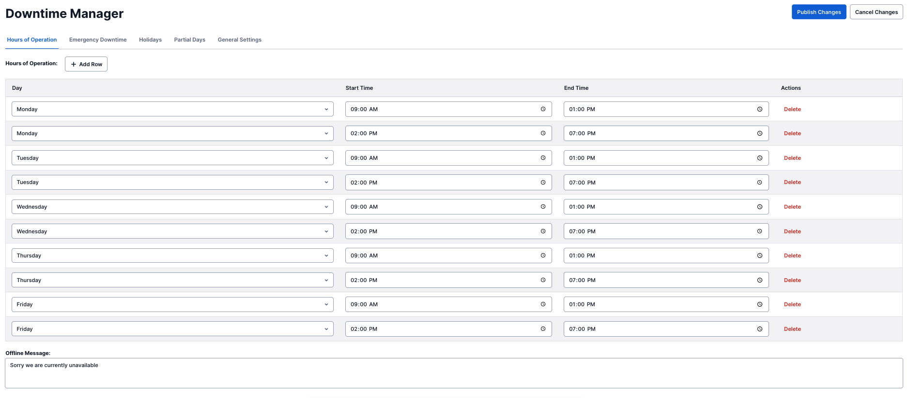
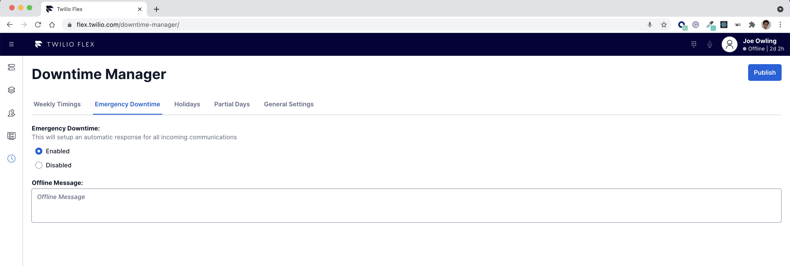
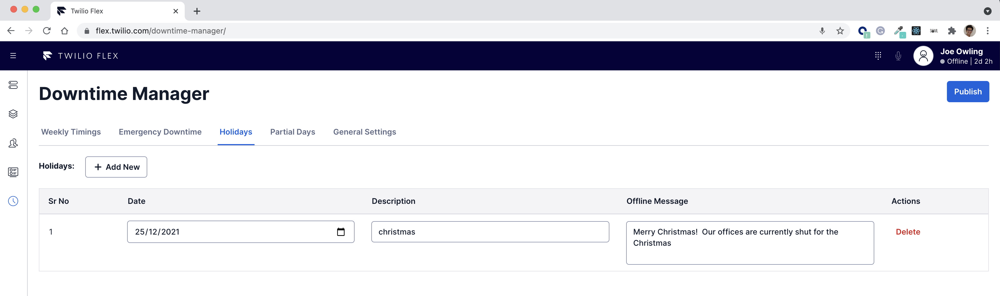
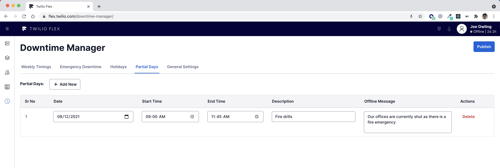
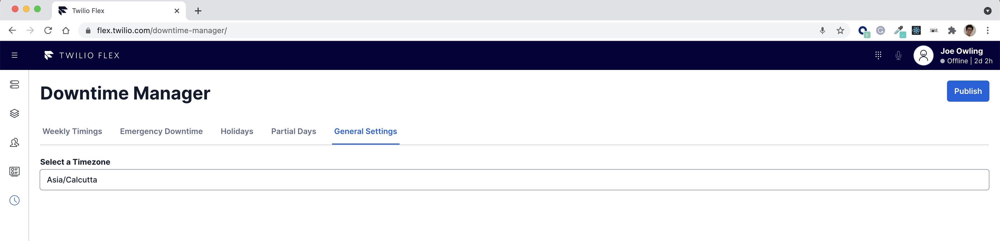
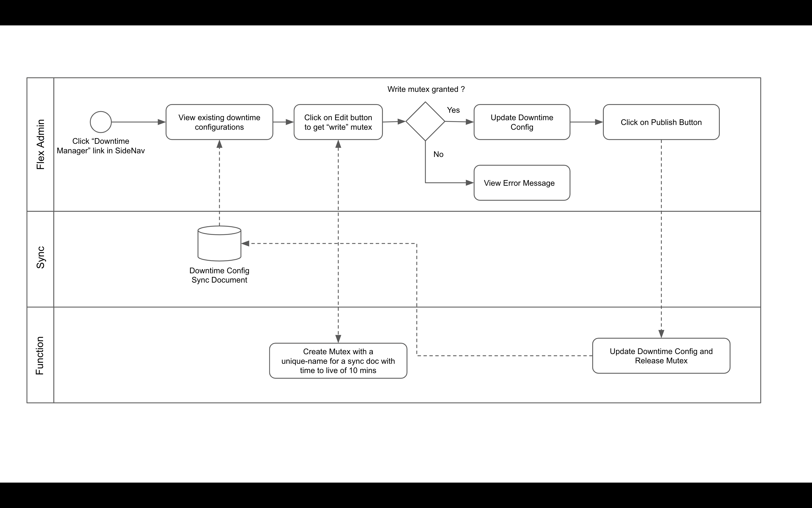
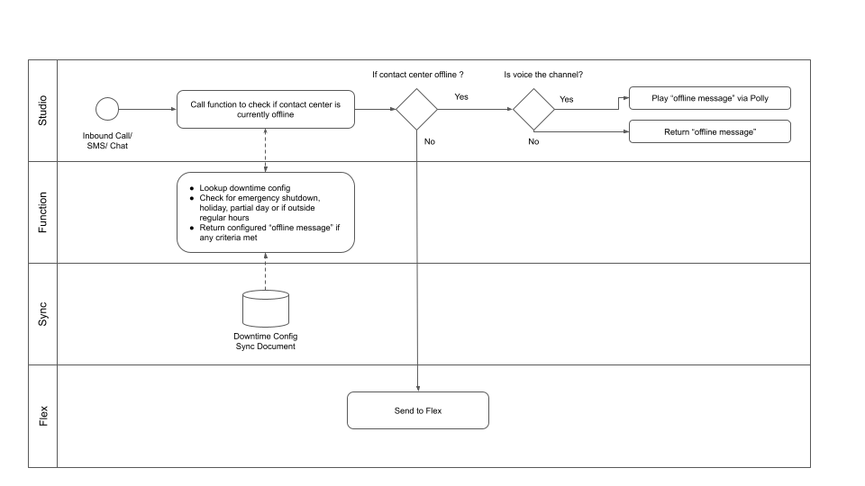
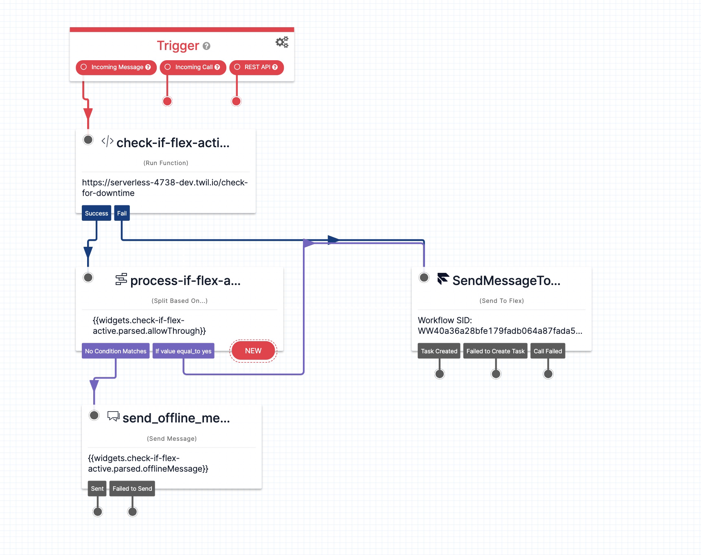
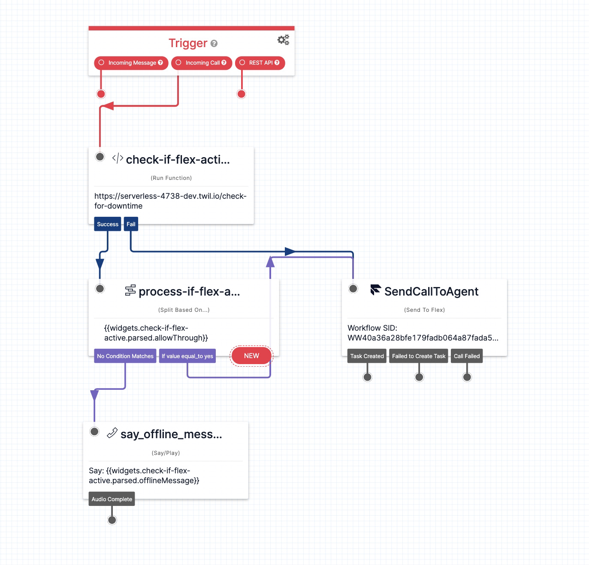

# Notice - Legacy Code

**This plugin is no longer maintained and has been updated as part of the [Flex Plugin Library](https://www.twilio.com/docs/flex/developer/plugins/plugin-library) where it is available as an out-of-box feature. The updated plugin is also available as part of the customizable [Flex Project Template](https://github.com/twilio-professional-services/flex-project-template), where it is an optional feature.**

# Overview

This solution addresses a common need for most contact centers to manage their downtimes.   
   
It aims to achieve this by intercepting all inbound requests in Twilio Studio Flow by invoking a Twilio Function which refers to a Twilio Sync Document holding the confguration.  

The code covers the following key elements of the solution:  
1) The Flex Plugin that adds a configuration screen for Administrator users
2) The Serverless function that is used to intercept the requests in the Studio Flow
3) The Serverless functions to disable concurrent writes to the configuration

# Flex Downtime Manager Plugin

The Flex Downtime Manager Plugin allows you to configure the downtime/offline hours for your contact center along with the responses to be played/sent back.  
   
The plugin allows you to configure the following:
* Regular Working Hours
* Emergency Shutdown
* Holidays
* Partial Days    

# Plugin UI Screenshots

This section provides visual examples of how to configure each above item:

* Configure Regular Working Hours



* Configure Emergency Shutdown



* Configure Holidays



* Configure Partial Days



* Configure Contact Center Timezone




# How Does it work ?

### Step 1. An Administrator configures the above settings and publishes them



### Step 2. Studio flows filter out the inbound communication and automatically respond back with offline messages




# How to use

### 1. Deploy the serverless function to your environment


1.1 copy `./serverless/.env.sample` to `./serverless/.env` and populate the appropriate environment variables.

```
ACCOUNT_SID=
AUTH_TOKEN=
TEAM_SCHEDULE_DOC_NAME= (Note: This will be unique name for the twilio sync doc )
SYNC_SERVICE_SID=
TEAM_SCHEDULE_MUTEX_SYNC_UNIQUE_NAME=(Note: This will be unique name for the twilio sync doc acting as write mutex )
TEAM_SCHEDULE_MUTEX_EXPIRY_MINUTES=10
```

1.2 cd into ./serverless/ then run 

`npm install` 

and then 

`twilio serverless:deploy` 


### 2. Update the studio flows to intercept the incoming communication

Update the studio flows for all the supported channels to have the above function intercept all the inbound requests.   
Based on the response of the function (allowThrough and offlineMessage), there will be 2 possibilities:  
1) The contact center is experiencing downtime  
    Condition: ["yes"===allowThrough]  
    Outcome: Say/Send back offlineMessage to the source  
2) The contact center is operational  
    Condition: ["no"===allowThrough]  
    Outcome: Send request to flex  

- Sample Webchat Studio Flow



- Sample IVR Studio Flow




### 3. Deploy the plugin

3.1 copy `./env.sample` to `./env` and populate the appropriate environment variables.
```
REACT_APP_TEAM_SCHEDULE_SYNC_UNIQUE_NAME=// (Note: This will be unique name for the twilio sync doc and same as TEAM_SCHEDULE_DOC_NAME above)
REACT_APP_DOWNTIME_MANAGER_VIEW_NAME=downtime-manager
```

3.2 Test the plugin locally

```bash
twilio flex:plugins:start
```

3.3 Deploy the plugin

```bash
twilio flex:plugins:deploy --major --changelog "Notes for this version" --description "Manage Downtime for contact center"
```

## Response from the interceptor function 

```
{
    "allowThrough":"yes", //or "no"
    "offlineMessage":""
}
``` 


## Sample Sync Document for Downtime Configuration  
  
  
```
{
   "generalSettings":{
      "timezone":"Asia/Calcutta"
   },
   "partialDays":{
      "12/26/2021":{
         "end":"16:00",
         "begin":"09:00",
         "offlineMessage":"We will be operational only for a limited hours on the day after christmas",
         "description":"Boxing Day"
      }
   },
   "emergencySettings":{
      "emergencyShutdown":false,
      "emergencyShutdownMessage":""
   },
   "regularHours":{
      "weeklyTimings": {
         "Monday": [
         {
            "begin": "09:00",
            "end": "13:00"
         },
         {
            "begin": "14:00",
            "end": "19:00"
         }
         ],
         "Tuesday": [
         {
            "begin": "09:00",
            "end": "13:00"
         },
         {
            "begin": "14:00",
            "end": "19:00"
         }
         ],
         "Friday": [
         {
            "begin": "09:00",
            "end": "13:00"
         },
         {
            "begin": "14:00",
            "end": "19:00"
         }
         ],
         "Wednesday": [
         {
            "begin": "09:00",
            "end": "13:00"
         },
         {
            "begin": "14:00",
            "end": "19:00"
         }
         ],
         "Thursday": [
         {
            "begin": "09:00",
            "end": "13:00"
         },
         {
            "begin": "14:00",
            "end": "19:00"
         }
         ],
         "Sunday": [],
         "Saturday": []
      },
      "offlineMessage":"We operate only from 10am to 7pm from Monday to Friday"
   },
   "holidays":{
      "12/25/2021":{
         "offlineMessage":"Merry Christmas! Our offices are currently shut for christmas. Goodbye!",
         "description":"christmas"
      }
   }
}
```

## Compatibility

The plugin uses input components from Twilio Paste Library which is compatible with Flex 2.0 and above.  
For previous versions of Flex, please replace the paste components with compatible material ui components.

References:
* Material UI components: https://v4.mui.com/ 
* Material Date/Time pickers: https://github.com/mui-org/material-ui-pickers 


## Setup

Make sure you have [Node.js](https://nodejs.org) as well as [`npm`](https://npmjs.com). We support Node >= 10.12 (and recommend the _even_ versions of Node). Afterwards, install the dependencies by running `npm install`:

```bash
cd 

# If you use npm
npm install
```

Next, please install the [Twilio CLI](https://www.twilio.com/docs/twilio-cli/quickstart) by running:

```bash
brew tap twilio/brew && brew install twilio
```

Finally, install the [Flex Plugin extension](https://github.com/twilio-labs/plugin-flex/tree/v1-beta) for the Twilio CLI:

```bash
twilio plugins:install @twilio-labs/plugin-flex@beta
```
